# UCM800模组蜂窝使用教程

### UCM800简介

UCM800是基于UC8088设计开发的蜂窝通信与卫星定位模组，功能完善，二次开发简便。本章节主要介绍蜂窝的使用教程，卫星定位教程见GNSS章节。

### 硬件开发

#### 模组最小系统原理图

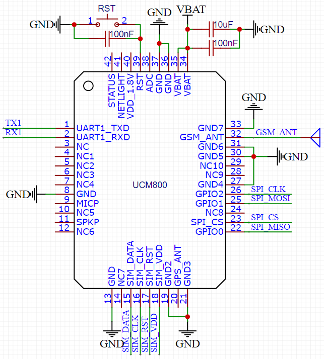

#### 电源

UCM800模组供电范围是3.3~4.2V，可用锂电池直接供电，推荐在VBAT引脚处添加10uF和100nF一大一小2个电容，保证电源纹波在50mV以下，同时保证在瞬态电流为2A时，VBAT电压不会跌到3.3V以下。

#### 复位

UCM800模组复位引脚为39号，需要硬件复位时，外部拉低39号引脚10ms以上再释放即可。复位脚已在内部拉高，不需要外部上拉。若不需要复位功能，39号引脚可以悬空。

#### GSM ANT

天线选用50欧阻抗、900M频段天线。PCB layout时，32号引脚走线需做50欧阻抗匹配，以保证蜂窝射频信号强度。

#### 串口

UCM800通过串口接收AT指令、返回状态，串口IO电平为3.3V，注意IO电平匹配。

#### 固件更新

固件更新接口为22/23/25/26引脚，引出后与烧写器对应口连接。

固件烧写软件：[UCDownloader_V0.01](https://uc8088.com/t/topic/62)

固件获取：[UCM800\_AT\_V0.0.1](https://uc8088.com/t/topic/63)

下载完成后，打开**downloader.exe**，目标MCU选择**UC8088**，Bin文件选择获取的固件，勾选**只擦除Code**，点击**在线编程**开始烧写固件。

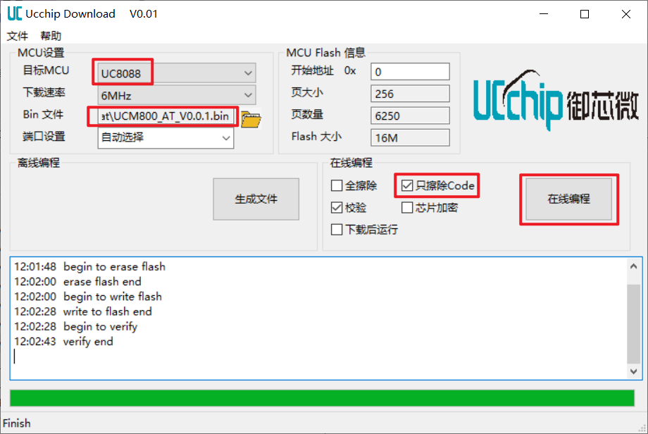

### AT软件开发

GPRS AT开发手册：[AT用户手册](https://uc8088.com/t/topic/63)

#### HTTP接入OneNET例程

进入[OneNET官网](https://open.iot.10086.cn/)，注册账号后选择产品服务->基础服务->OneNET Studio：

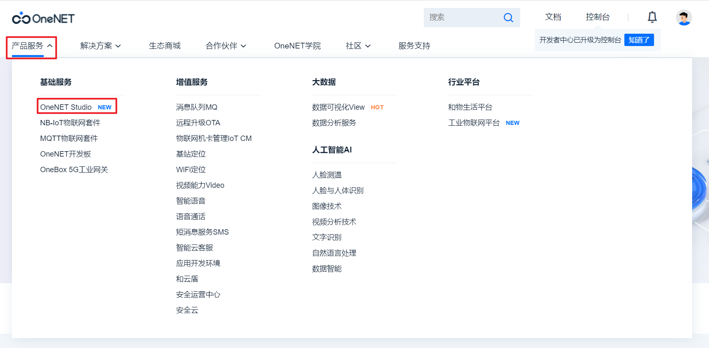

在OneNET控制台中选择全部产品->多协议接入：

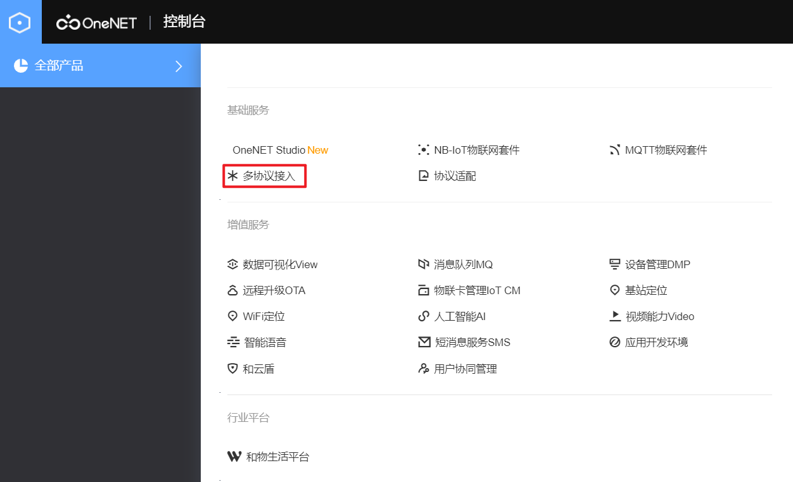

在多协议接入中选择HTTP->添加产品：

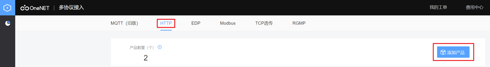

在弹出的产品菜单中填写产品相关信息，产品信息根据情况填写，主要用于客户自己识别：

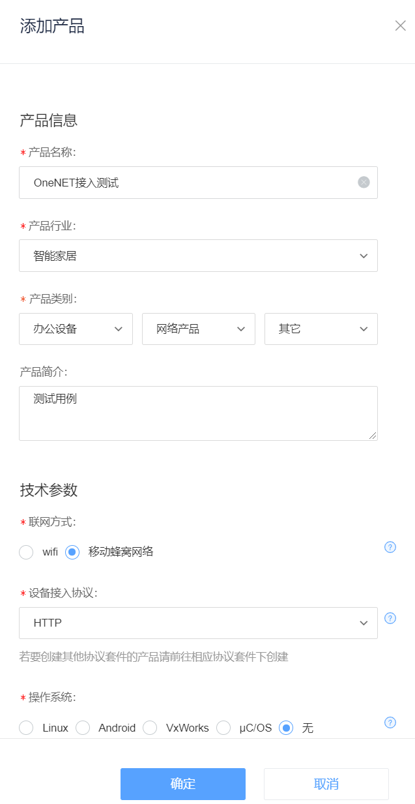

之后在设备列表中添加设备：

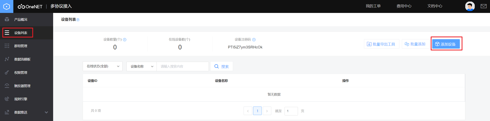

设备信息根据客户情况填写，设备编号可以填写模组上的IMEI号：

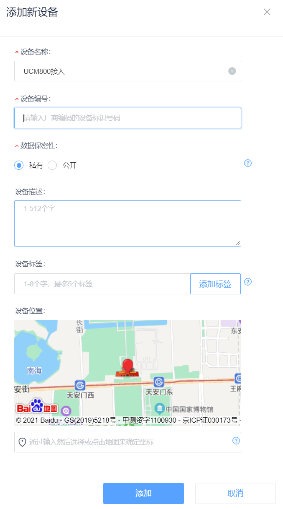

添加完设备后，可以在设备列表中选择详情，查看设备信息，添加APIKey，APIKey随意填写。记录下API地址和APIKey，后续用于HTTP连接和鉴权：

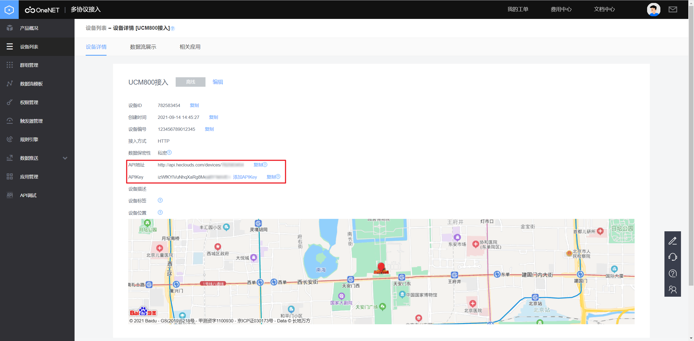

OneNET平台端设置完成后，通过串口发送AT命令对UCM800进行配置：

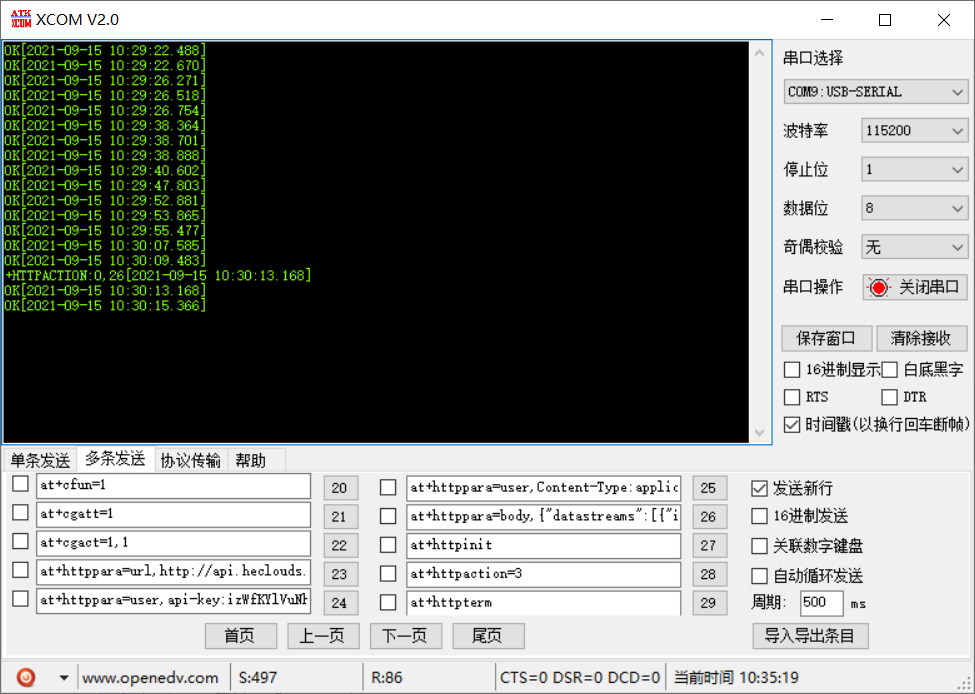

**at+cfun=1** //设置全功能，设备上电

OK //返回ERROR，请检查SIM卡是否正常

**at+cgatt=1** //GPRS注册

OK

**at+cgact=1,1** //PDP激活

OK

**at+httppara=url,http://api.heclouds.com/devices/782583454/datapoints** //设备ID：782583454，根据客户的API地址更改

OK

**at+httppara=user,api-key:izWfKYlVuNhqXaRg8Moa6Y1khVE=**  //设置APIKey，根据客户APIKey更改

OK

**at+httppara=user,Content-Type:application/json** //根据OneNET平台要求设置 见[OneNET开发文档](https://open.iot.10086.cn/doc/multiprotocol/book/develop/http/api/15.%E4%B8%8A%E4%BC%A0%E6%95%B0%E6%8D%AE%E7%82%B9.html)

OK

**at+httppara=body,{"datastreams":[{"id":"temp","datapoints":[{"value":11}]}]}**  //设置上传至OneNET平台数据

OK

**at+httpinit** //http配置完成后初始化

OK

**at+httpaction=3** //http开始上传

+HTTPACTION:0,26

OK

**at+httpterm** //上传结束后关闭http

OK

更多AT指令，详见[AT用户手册](https://uc8088.com/t/topic/63)。

上传完毕后，可在OneNET平台查看数据：

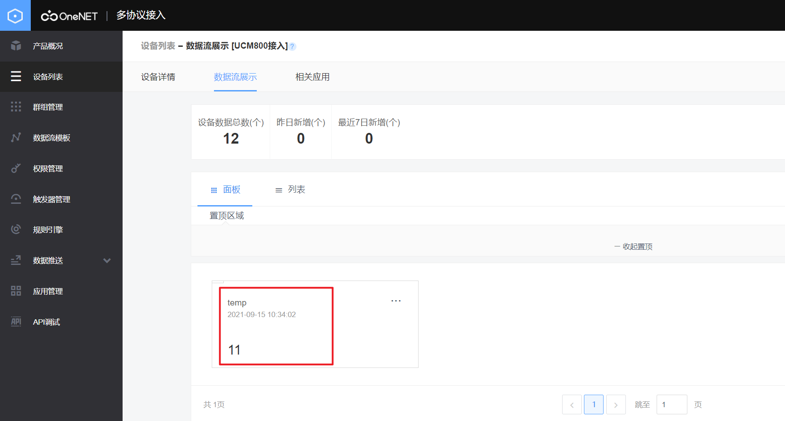