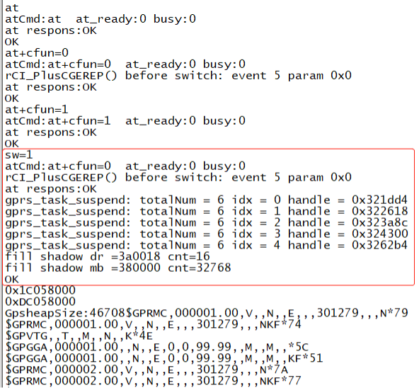
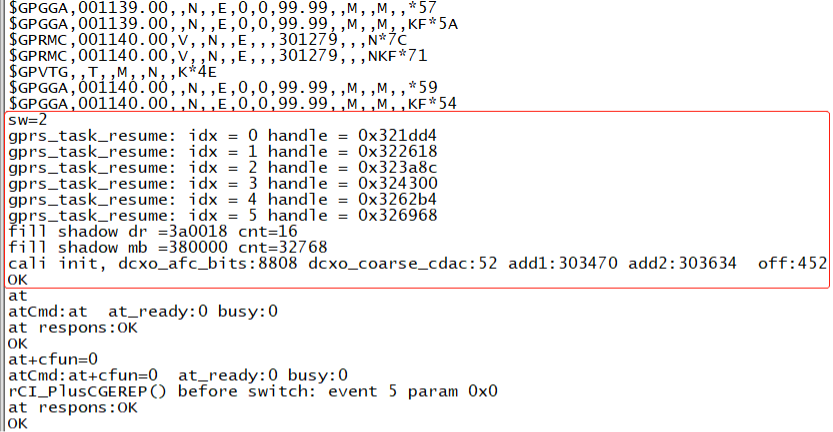

# 概述

8088模组支持GPS与GPRS两种模式，这里可根据需要通过写入静态数据实现模式的支持（详见[设备控制类静态信息](uc8088_static_data.md)）。当需要在 GPS/GPRS 之间切换时，则通过 SW 命令进行控制。

# SW命令的使用

## sw=1

软件由gprs模式切换到gps模式。如果当前gprs处于gmm注册状态，则此功能将隐式执行去附着指令，待完成后再切换到gps模式，如果当前gprs未注册到网络，则直接切换到gps模式；

## sw=2

软件由gps模式切换到gprs模式。此指令将直接结束gps任务，将软件切换到gprs模式；

# 使用演示

下图是通过串口工具发送sw指令以及AT指令进行演示说明（注：在发送命令后跟“\r\n”）。

**GPRS —> GPS**

 

**GPS —> GPRS**

 
