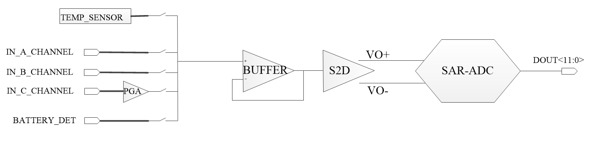

# 辅助ADC综述 #
## 简介 ##
UC8088的辅助ADC（AUX_ADC，ADC默认表示AUX_ADC）电路原理框图如下图所示。包含模拟路由器、缓冲器（Buffer）、单转双buffer（S2D）和逐次逼近型ADC（SQR-ADC）组成。  

SAR-ADC 位宽为12bit，最高采样率可以到360KSPS（360K、180K，90K，45K四个档位可选，可以通过寄存器来修改ADC的时钟频率），8088一共有4个通道连接到辅助ADC，第一路是温度传感器部分电路，第二、第三、第四通道分别为IN_A_CHANNEL、IN_B_CHANNEL，IN_C_CHANNEL为片外输入信号通道，与第二、三通道片外信号直接输入不同的是，第四通道片外信号进入片内后经过PGA放大后再送到辅助ADC进行量化，PGA增益范围为（0.915~30dB），可由寄存器进行控制。另外还有一路电池电压检测通路，该电压是由电池电压进行分压（默认值是除以2.8，该值可由寄存器进行选择）后送入到ADC通路。辅助ADC的输入电压范围为0.1V~AVDD_CAP-0.1，参考电压即为AVDD_CAP。
## 访问ADC设备 ##
访问ADC设备，库中提供了以下接口：

|函数|描述|
|:---:|:---:|
|void adc_power_set(ADDA_TypeDef *ADDA)|初始化ADC设备|
|void adc_reset(ADDA_TypeDef *ADDA)|ADC设备复位|
|void adc_set_sample_rate(ADDA_TypeDef *ADDA, ADC_SAMPLE_RATE sample_rate)|设置采样率|
|void adc_channel_select(ADDA_TypeDef *ADDA, ADC_CHANNEL CHANNEL)|选择采样通道|
|void adc_int_enable(ADDA_TypeDef *ADDA)|中断采样使能|
|void adc_int_disable(ADDA_TypeDef *ADDA)|中断采样失能|
|void adc_int_clear_pending(void)|清中断标志位|
|void adc_wait_data_ready(ADDA_TypeDef *ADDA)|等待数据转换完成|
|uint16_t adc_read(ADDA_TypeDef *ADDA)|读取ADC值|
|adc_watermark_set(ADDA_TypeDef *ADDA, uint8_t water_mark)|设置采样水线|
|bool is_adc_fifo_over_watermark(ADDA_TypeDef *ADDA)|查看adc缓存是否已达到采样水线|
|bool is_adc_fifo_empty(ADDA_TypeDef *ADDA)|查看adc缓存是否为空|
|void adc_fifo_clear(ADDA_TypeDef *ADDA)|清空adc缓存|
|void adc_vbat_measure_enable(bool enable)|电源采样使能|
|void adc_temp_source_sel(ADDA_TypeDef *ADDA, ADC_TEMP_SRC temp_src)|设置温度传感器采样目标|
|void adc_temp_sensor_enable(ADDA_TypeDef *ADDA, bool enable)|温度传感器采用使能|

### 初始化ADC器件 ###
使能ADC器件，函数原型如下所示：  
```C
void adc_power_set(ADDA_TypeDef *ADDA)
{
    CHECK_PARAM(PARAM_ADDC(ADDA));

	avdd_cap_calibrate(ADDA);
    ADDA->ADC_CTRL0 &= ~(1<<31);

	ADDA->ADC_CTRL0 &= ~(0x0F<<28);//disable channel a, channel b, channel c and inside temp channel
	ADDA->ADC_CTRL0 |= BIT(22)|BIT(21)|BIT(20)|BIT(18)|BIT(17)|BIT(16)|BIT(12)|BIT(7)|BIT(6)|BIT(27)|BIT(8);//|BIT(19);

	ADDA->ADC_CTRL1 &= ~BIT(2);//disable battery channel
	ADDA->ADC_CTRL1 |= BIT(17);// |BIT(27)|BIT(26);

	ADDA->ADC_CTRL1 &= ~(0x03<<26);
	ADDA->ADC_CTRL1 |= 0x03<<26;//adc_clk=26M/32, adc_sample_rate=adc_clk/18

	//ADDA->ADC_CTRL1 =  (ADDA->ADC_CTRL1 & (~(0x07<<18))) 
}
```

### 复位ADC器件 ###
复位ADC，函数原型如下所示：  
```C
void adc_reset(ADDA_TypeDef *ADDA)
{
    CHECK_PARAM(PARAM_ADDC(ADDA));
    
    ADDA->ADC_CTRL0 &= ~(1<<8);
    //delay 10us
    for (int i = 0; i < 131*10; i++)
    {
        asm("nop");
    }
    ADDA->ADC_CTRL0 |= 1<<8;    
}
```

### 设置ADC采样率 ###
设置ADC采样率，函数原型如下所示：  
```C
void adc_set_sample_rate(ADDA_TypeDef *ADDA, ADC_SAMPLE_RATE sample_rate)
{
    CHECK_PARAM(PARAM_ADDC(ADDA));
	ADDA->ADC_CTRL1 = (ADDA->ADC_CTRL1 & (~(0x03<<26))) | sample_rate;
}
```

### 选择ADC采样通道 ###
选择ADC采样通道，函数原型如下所示：  
```C
void adc_channel_select(ADDA_TypeDef *ADDA, ADC_CHANNEL CHANNEL)
{
    CHECK_PARAM(PARAM_ADDC(ADDA));
	ADDA->ADC_CTRL0 &= ~(0x0F<<28);//disable channel a, channel b, channel c and inside temp channel
	ADDA->ADC_CTRL1 &= ~BIT(2);//disable battery channel

    if (CHANNEL != ADC_CHANNEL_BAT)
    {
        ADDA->ADC_CTRL0 |= CHANNEL;
    }
    else
    {
        ADDA->ADC_CTRL1 |= CHANNEL;
    }
}
```

### 使能ADC中断 ###
使能ADC中断，函数原型如下所示：  
```C
void adc_int_enable(ADDA_TypeDef *ADDA)
{
	CHECK_PARAM(PARAM_ADDC(ADDA));
	ADDA->ADDA_IRQ_CTRL |= (1<<0);
	IER |= (1 << 20);
}
```

### 失能ADC中断 ###
失能ADC中断，函数原型如下所示：  
```C
void adc_int_disable(ADDA_TypeDef *ADDA)
{
	CHECK_PARAM(PARAM_ADDC(ADDA));
	ADDA->ADDA_IRQ_CTRL &= ~(1<<0);
	IER &= ~(1 << 20);
}
```

### 清ADC中断标志位 ###
清ADC中断标志位，函数原型如下所示：  
```C
void adc_int_clear_pending(void)
{
	ICP |= 1<<20;
}
```

### 等待ADC采样结束 ###
等待ADC采样结束，函数原型如下所示：  
```C
void adc_wait_data_ready(ADDA_TypeDef *ADDA)
{
	while ((ADDA->ADC_FIFO_CTRL & (1<<19)) != 0)//wait data ready
	{
		asm("nop");
	}
}
```

### 读取ADC值 ###
读取ADC值，函数原型如下所示：  
```C
uint16_t adc_read(ADDA_TypeDef *ADDA)
{
    CHECK_PARAM(PARAM_ADDC(ADDA));

    return ADDA->ADC_FIFO_READ;
}
```

### 设置ADC水线 ###
设置ADC水线，函数原型如下所示：  
```C
void adc_watermark_set(ADDA_TypeDef *ADDA, uint8_t water_mark)
{
    CHECK_PARAM(PARAM_ADDC(ADDA));
    ADDA->ADC_FIFO_CTRL = water_mark << 8;
}
```

### 查询是否超出水线 ###
查询是否超出水线，函数原型如下所示：  
```C
bool is_adc_fifo_over_watermark(ADDA_TypeDef *ADDA)
{
    CHECK_PARAM(PARAM_ADDC(ADDA));
    int over_watermark = (ADDA->ADC_FIFO_CTRL >> 17) & 0x1;
    if(over_watermark)
        return true;
    else
        return false;
}
```

### 查询ADC缓存是否为空 ###
查询ADC缓存是否为空，函数原型如下所示：  
```C
bool is_adc_fifo_empty(ADDA_TypeDef *ADDA)
{
	CHECK_PARAM(PARAM_ADDC(ADDA));
    if (((ADDA->ADC_FIFO_CTRL >> 19) & 0x1) == 1)
    {
        return true;
	}
    else
	{
        return false;
	}
}
```

### 清空ADC缓存 ###
清空ADC缓存，函数原型如下所示：  
```C
void adc_fifo_clear(ADDA_TypeDef *ADDA)
{
    CHECK_PARAM(PARAM_ADDC(ADDA));
    ADDA->ADC_FIFO_CTRL |= 1 << 31;
	ADDA->ADC_FIFO_CTRL &= ~BIT(31);//must clear the bit manually
}
```

### 使能电源ADC采样 ###
使能电源ADC采样，函数原型如下所示：  
```C
void adc_vbat_measure_enable(bool enable)
{
    REG(0x1A104228) = (REG(0x1A104228) & (~BIT(4))) | (enable << 4);
}
```

### 设置温度传感器采样目标 ###
设置温度传感器采样目标，函数原型如下所示：  
```C
void adc_temp_source_sel(ADDA_TypeDef *ADDA, ADC_TEMP_SRC temp_src)
{
    CHECK_PARAM(PARAM_ADDC(ADDA));
    ADDA->ADC_CTRL0 &= ~(0x07<<24);
    ADDA->ADC_CTRL0 |= temp_src;
}
```

### 使能温度传感器采样 ###
设置温度传感器采样目标，函数原型如下所示：  
```C
void adc_temp_sensor_enable(ADDA_TypeDef *ADDA, bool enable)
{
    CHECK_PARAM(PARAM_ADDC(ADDA));
	ADDA->ADC_CTRL0 &= ~BIT(6);//disable imax mode
	ADDA->ADC_CTRL0 |= BIT(27)|BIT(21)|BIT(19);//enable vcm for temp measure, ADC_TEMP power and ADC_TEMP current limit
    ADDA->ADC_CTRL0 = (ADDA->ADC_CTRL0 & (~BIT(23))) | (enable << 23);//enable ADC_TEMP sensor
	ADDA->ADC_CTRL0 &= ~0x07;//set ADC_TEMP internal trim
	ADDA->ADC_CTRL1 =  (ADDA->ADC_CTRL1 & (~(0x03<<21))) | (0x03 << 21);//set ADC_TEMP PGA gain
}
```

## ADC使用示例 ##
以下提供采样电源电压、温度传感器等实例
```C
#include <stdio.h>
#include "adda.h"
#include "event.h"
#include "int.h"
#include "string_lib.h"


#define _DAC_OUT_SINE_WAVE
#define _ADC_SAMPLE_IN_ISR

static void delay_ms(uint32_t nms)
{
    for(int i=0;i<nms;i++)
    {
        for(int j=0;j<4500*3;j++)
        {
            asm("nop");
        }
    }
}

volatile static int adc_sample_cnt = 0;
static uint16_t adc_buf[512];
void ISR_ADC(void)
{
	adc_int_clear_pending();
	while (!is_adc_fifo_empty(UC_ADDA))
	{
		if (adc_sample_cnt < sizeof(adc_buf)/sizeof(adc_buf[0]))
		{
			adc_buf[adc_sample_cnt++] = adc_read(UC_ADDA);
		}
		else
		{
			//adc_read(UC_ADDA);//discard
			adc_int_disable(UC_ADDA);
			break;
		}
	}
}

void adc_battery_voltage_measure_demo(void)
{
    uint32_t adc_val, adc_sum, adc_cnt;
	float bat_vol;
    printf("---------ADC battery voltage measure demo start---------\r\n");
    adc_power_set(UC_ADDA);
	adc_set_sample_rate(UC_ADDA, ADC_SR_45KSPS);
    adc_watermark_set(UC_ADDA, 128);

	adc_channel_select(UC_ADDA, ADC_CHANNEL_BAT);
	adc_vbat_measure_enable(true);

    adc_reset(UC_ADDA);
    adc_fifo_clear(UC_ADDA);

    adc_sum = 0;
    for (adc_cnt = 0; adc_cnt < 64; adc_cnt++)
    {
        adc_wait_data_ready(UC_ADDA);
        adc_sum += adc_read(UC_ADDA);
    }

    adc_val = ((adc_sum + (1<<5)))>>6;//div 64
	bat_vol = (float)adc_val/4096*1.6*2.8;//formula
    printf("adc_val = %d bat_vol = %.2oV\r\n", adc_val, *((int *)&bat_vol));
	printf("---------ADC battery voltage measure demo end---------\r\n");
}

void adc_temp_in_chip_measure_demo(void)
{
    uint32_t adc_val, adc_sum, adc_cnt;
	float temp_val;
	int adc_data = 0;
	
    printf("---------ADC temp in-chip measure demo start---------\r\n");
											
	temp_in_pt1000(UC_ADDA);
    adc_reset(UC_ADDA);
	delay_ms(500);
	
    adc_fifo_clear(UC_ADDA);

    adc_sum = 0;
    for (adc_cnt = 0; adc_cnt < 64; adc_cnt++)
    {
        adc_wait_data_ready(UC_ADDA);
        adc_sum += adc_read(UC_ADDA);
    }

    adc_val = ((adc_sum + (1<<5)))>>6;//div 64
	temp_val = (float)(adc_val-1844)/7.3;//formula 2521
    printf("adc_val = %d temp_vol = %.1o Celsius\r\n", adc_val, *((int *)&temp_val));
	printf("---------ADC temp in-chip measure demo end---------\r\n");
}

void adc_dac_loopback_test_demo(void)
{
    uint32_t adc_cnt;
    printf("---------ADC & DAC loopback test demo start---------\r\n");
	printf("Before testing, you should connect 'AUDIO' to 'ADC_A'!\r\n");
#ifdef _DAC_OUT_SINE_WAVE
	dac_output_sine_wave();//varibale voltage
#else
	dac_output_voltage(0.8);//stable voltage
#endif

    adc_power_set(UC_ADDA);
	adc_set_sample_rate(UC_ADDA, ADC_SR_45KSPS);
    adc_watermark_set(UC_ADDA, 128);

	adc_channel_select(UC_ADDA, ADC_CHANNEL_C);

    adc_reset(UC_ADDA);
    adc_fifo_clear(UC_ADDA);

#ifdef _ADC_SAMPLE_IN_ISR
	adc_int_enable(UC_ADDA);
	int_enable();
	while (adc_sample_cnt < sizeof(adc_buf)/sizeof(adc_buf[0]))
	{
		asm("nop");
	}
#else
    for (adc_cnt = 0; adc_cnt < sizeof(adc_buf)/sizeof(adc_buf[0]); adc_cnt++)
    {
        adc_wait_data_ready(UC_ADDA);
        adc_buf[adc_cnt] = adc_read(UC_ADDA);
    }
#endif
    for (adc_cnt = 0; adc_cnt < sizeof(adc_buf)/sizeof(adc_buf[0]); adc_cnt++)
    {
		printf("adc_buf[%d] = %d\r\n", adc_cnt, adc_buf[adc_cnt]);
    }

	printf("---------ADC & DAC loopback test demo end---------\r\n");
}

int main(int argc, char **argv)
{
	printf("---------ADC demo start---------\r\n");

	while(1)
	{
		adc_battery_voltage_measure_demo();
		adc_temp_in_chip_measure_demo();
		adc_dac_loopback_test_demo();
	}
    return 0;
}
```

