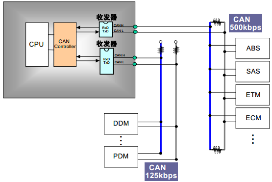

# CAN 设备


## CAN简介

CAN 是控制器局域网络 (Controller Area Network, CAN) 的简称，是由以研发和生产汽车电子产品著称的德国 BOSCH 公司开发的，并最终成为国际标准（ISO 11898），是国际上应用最广泛的现场总线之一。

CAN 控制器根据两根线上的电位差来判断总线电平。总线电平分为显性电平和隐性电平，二者必居其一。发送方通过使总线电平发生变化，将消息发送给接收方。 CAN 的连接示意图如下图所示：




CAN 总线有如下特点：

- CAN 总线是可同时连接多个单元的总线。可连接的单元总数理论上是没有限制的。但实际上可连接的单元数受总线上的时间延迟及电气负载的限制。降低通信速度，可连接的单元数增加；提高通信速度，则可连接的单元数减少。

- 多主控制。在总线空闲时，所有的单元都可开始发送消息（多主控制）。多个单元同时开始发送时，发送高优先级 ID 消息的单元可获得发送权。

- 消息的发送。在 CAN 协议中，所有的消息都以固定的格式发送。总线空闲时，所有与总线相连的单元都可以开始发送新消息。两个以上的单元同时开始发送消息时，根据标识符 ID 决定优先级。ID 表示访问总线的消息的优先级。两个以上的单元同时开始发送消息时，对各消息 ID 的每个位进行逐个仲裁比较。仲裁获胜（被判定为优先级最高）的单元可继续发送消息，仲裁失利的单元则立刻停止发送而进行接收工作。

- 根据整个网络的规模，可设定适合的通信速度。在同一网络中，所有单元必须设定成统一的通信速度。即使有一个单元的通信速度与其它的不一样，此单元也会输出错误信号，妨碍整个网络的通信。不同网络间则可以有不同的通信速度。

  CAN 协议包括 5 种类型的帧：

- 数据帧

- 遥控帧

- 错误帧

- 过载帧

- 帧间隔

数据帧和遥控帧有标准格式和扩展格式两种格式。标准格式有 11 个位的 ID，扩展格式有 29 个位的 ID。

各种帧的用途如下表所示

| 帧     | 帧用途                                           |
| ------ | ------------------------------------------------ |
| 数据帧 | 用于发送单元向接收单元传送数据的帧               |
| 遥控帧 | 用于接收单元向具有相同 ID 的发送单元请求数据的帧 |
| 错误帧 | 用于当检测出错误时向其它单元通知错误的帧         |
| 过载帧 | 用于接收单元通知其尚未做好接收准备的帧           |
| 帧间隔 | 用于将数据帧及遥控帧与前面的帧分离开来的帧       |


## 访问CAN设备

应用程序通过库函数提供的接口来访问8288的CAN设备，相关接口如下所示:

| 函数               | 描述                |
| ------------------ | ------------------- |
| can_mode_init();   | CAN总线初始化函数   |
| can_send_msg();    | CAN总线发送数据函数 |
| can_receive_msg(); | CAN总线接收数据函数 |


## 初始化CAN总线

```C
uint8_t can_mode_init(uint8_t tsjw,uint8_t tbs2,uint8_t tbs1,uint16_t brp,uint8_t mode);
```

| 参数         | 描述                                                     |
| ------------ | -------------------------------------------------------- |
| uint8_t tsjw | 重新同步跳跃时间单元.范围:CAN_SJW_1tq~ CAN_SJW_4tq       |
| uint8_t tbs2 | 时间段2的时间单元.   范围:CAN_BS2_1tq~CAN_BS2_8tq        |
| uint8_t tbs1 | 时间段1的时间单元.   范围:CAN_BS1_1tq ~CAN_BS1_16tq      |
| uint16_t brp | 波特率分频器.范围:1~1024                                 |
| uint8_t mode | mode:CAN_Mode_Normal,普通模式;CAN_Mode_LoopBack,回环模式 |

波特率计算公式：
$$
 tq=(brp)*tpclk1
$$

$$
波特率=Fpclk1/((tbs1+1+tbs2+1+1)*brp)
$$


## CAN总线发送数据

```C
uint8_t can_send_msg(uint8_t* msg,uint8_t len);
```

| 参数         | 描述                        |
| ------------ | --------------------------- |
| uint8_t* msg | msg:数据指针,最大为8个字节. |
| uint8_t len  | len:数据长度(最大为8)       |
| 返回值       | 0:成功,其他:失败;           |


## CAN总线接收数据

```C
uint8_t can_receive_msg(uint8_t *buf);
```

| 参数         | 描述                               |
| ------------ | ---------------------------------- |
| uint8_t *buf | buf:数据缓存区;                    |
| 返回值       | 0:无数据被收到,其他:接收的数据长度 |

## 操作CAN实例

```C
#include <stdio.h>
#include "event.h"
#include "int.h"
#include "string_lib.h"
#include "can.h"
#include "gpio.h"

static uint8_t can_mode_init(uint8_t tsjw,uint8_t tbs2,uint8_t tbs1,uint16_t brp,uint8_t mode);
static uint8_t can_send_msg(uint8_t *msg,uint8_t len);
static uint8_t can_receive_msg(uint8_t *buf);


int main(int argc, char **argv)
{
	uint8_t canbuf[8] 	= {0};
	uint8_t i 	  		= 0;
	uint8_t state 		= 0;
	uint8_t state1		= 0;
	

	printf("---------CAN demo start---------\r\n");
	
	can_mode_init(CAN_SJW_1tq,CAN_TS2_8tq,CAN_TS1_9tq,4,CAN_Mode_LoopBack);//CAN初始化环回模式,波特率500Kbps    
	
	for(i=0;i<8;i++){
		canbuf[i] = i;
		printf("send canbuf[%d] is %d \r\n",i,i);
	}
	
	state = can_send_msg(canbuf,8);
	
	if(state){
		printf("send data failed ! \r\n");
	}
	else{
		printf("send data ok ! \r\n");
	}
	
	state1 = can_receive_msg(canbuf);
	
	if(state1){
		
		for(i=0;i<state1;i++){
			canbuf[i] = i;
			printf("receive canbuf[%d] is %d \r\n",i,i);
		}
		
	}
	
	while (1);
	
	return 0;

}
```

