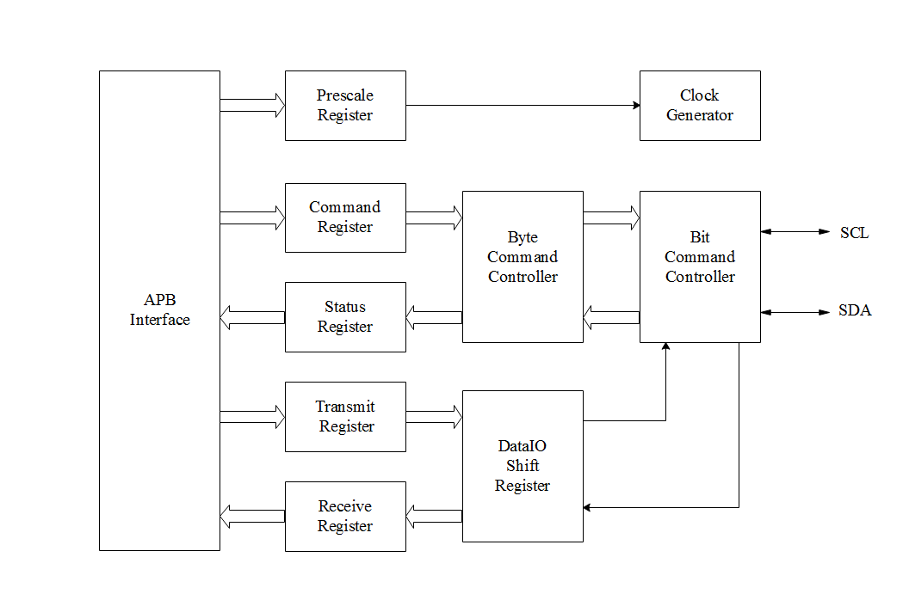

# I2C总线 #
## I2C简介 ##
I2C(芯片间)总线接口连接微控制器和串行I2C总线。它提供多主机功能，控制所有I2C总线特定的时序、协议、仲裁和定时。I2C是两线双向串行总线，它提供了一种简单而有效的方法在设备之间进行数据交换。I2C总线框架如下图：  

## 访问I2C设备 ##
一般情况下MCU的I2C设备都作为主机来与下属设备（从机）通讯，在御芯微的SDK中以库的方式提供I2C的操作接口，相关接口如下：

|函数|描述|
|:---:|:---:|
|void i2c_setup(I2C_TYPE *I2C, I2C_CFG_Type *I2CconfigStruct)|初始化I2C设备，并配置I2C工作模式|
|void i2c_cmd(I2C_TYPE *I2C, FunctionalState NewState)|配置I2C工作模式|
|void i2c_send_command(I2C_TYPE *I2C, I2C_CMD cmd)|I2C发送命令|
|void i2c_send_data(I2C_TYPE *I2C, uint8_t data)|I2C发送数据|
|uint32_t i2c_get_status(I2C_TYPE *I2C)|获取当前状态|
|I2CTXStatus i2c_get_txstatus(I2C_TYPE *I2C)|获取当前发送状态|
|I2CACK i2c_get_ack(I2C_TYPE *I2C)|等待应答|
|uint32_t i2c_get_data(I2C_TYPE *I2C)|读取数据|
|I2CStatus i2c_busy(I2C_TYPE *I2C)|查询I2C是否为忙状态|

### 初始化I2C器件 ###
在使用I2C总线时，首先应对其进行初始化，指定I2C设备地址，并指定工作模式，初始化函数原型如下所示：  
```C
void i2c_setup(I2C_TYPE *I2C, I2C_CFG_Type *I2CconfigStruct)
{
    CHECK_PARAM(PARAM_I2C(I2C));
    CHECK_PARAM(PARAM_I2C_TRANSFER_RATE(I2CconfigStruct->prescaler));

    gpio_set_pin_mux(UC_GPIO_CFG, GPIO_PIN_3, GPIO_FUNC_1);
    gpio_set_pin_pupd(UC_GPIO_CFG, GPIO_PIN_3, GPIO_PUPD_UP);
    gpio_set_pin_mux(UC_GPIO_CFG, GPIO_PIN_4, GPIO_FUNC_1);
    gpio_set_pin_pupd(UC_GPIO_CFG, GPIO_PIN_4, GPIO_PUPD_UP);

    I2C->CPR = I2CconfigStruct->prescaler & I2C_PRESCALER_MASK;

    I2C->CTR |= (I2C_ENABLE_MASK);
}
```

### 配置I2C工作模式 ###
在I2C器件初始化时已经配置了其工模式，i2c_cmd()函数可在初始化后对其进行修改，用法同i2c_setup()，函数原型如下：  
```C
void i2c_cmd(I2C_TYPE *I2C, FunctionalState NewState)
{
    CHECK_PARAM(PARAM_I2C(I2C));
    CHECK_PARAM(PARAM_I2C_ENBIT(NewState));

    if(NewState)
    {
        I2C->CTR |= (I2C_ENABLE_MASK);
    }
    else
    {
        I2C->CTR &= ~(I2C_ENABLE_MASK);
    }
}
```

### 数据传输 ###
数据传输含有两个函数，分别是i2c_send_command()和i2c_send_data()，用发相同，函数原型如下：  
```C
void i2c_send_command(I2C_TYPE *I2C, I2C_CMD cmd)
{
    CHECK_PARAM(PARAM_I2C(I2C));
    CHECK_PARAM(PARAM_I2C_CMD(cmd));

    I2C->CDR = cmd;
}
```

```C
void i2c_send_data(I2C_TYPE *I2C, uint8_t data)
{
    CHECK_PARAM(PARAM_I2C(I2C));

    I2C->TXR = data;
}
```

### 获取状态 ###
获取I2C器件状态，可单一读取某一寄存器值，也可读取全部寄存器的值，获取状态的函数原型包含一下3个：  
```C
uint32_t i2c_get_status(I2C_TYPE *I2C)
{
    uint32_t temreg;

    CHECK_PARAM(PARAM_I2C(I2C));

    temreg = I2C->STR;

    return temreg;
}
```

```C
I2CTXStatus i2c_get_txstatus(I2C_TYPE *I2C)
{
    I2CTXStatus temstatus;

    CHECK_PARAM(PARAM_I2C(I2C));

    temstatus = (I2CTXStatus)(I2C->STR & I2C_TIP_MASK);

    return temstatus;
}
```

```C
I2CStatus i2c_busy(I2C_TYPE *I2C)
{
    CHECK_PARAM(PARAM_I2C(I2C));

    return ((I2C->STR&I2C_BUSY_MASK) == I2C_BUSY_MASK);
}
```

### 读取数据 ###
I2C获取的数据包含两类，一类是对端发送的数据，另一类是I2C总写协议中固定的ACK应答数据，获取数据和应答的函数原型如下：  
```C
uint32_t i2c_get_data(I2C_TYPE *I2C)
{	
    CHECK_PARAM(PARAM_I2C(I2C));

	return (I2C->RXR & 0xff);
}
```

```C
I2CACK i2c_get_ack(I2C_TYPE *I2C)
{
    CHECK_PARAM(PARAM_I2C(I2C));
	while((I2C->STR & I2C_STATUS_TIP) == 0);// need TIP go to 1
	while((I2C->STR & I2C_STATUS_TIP) != 0);// and then go back to 0

	return !(I2C->STR & I2C_STATUS_RXACK);// invert since signal is active low
}
```

## I2C使用示例 ##
在以下实例中，I2C从机挂接一颗AT24C02，AT24C02是一个2K位的串行CMOS E2PROM，内部含有256个8位字节，该器件通过I2C总线进行操作。示例代码操作如下：  
&emsp;&emsp;1.初始化I2C器件；  
&emsp;&emsp;2.向AT24C02的一块存储区域写入一串数据；  
&emsp;&emsp;3.将AT24C02写入数据区域的数据读出；  
&emsp;&emsp;4.对比写入与读出的数据是否一致；  
```C
#include <stdio.h>
#include <stdint.h>
#include "i2c.h"
#include "event.h"
#include "int.h"

#define AT24C02_ADDR 0xA0

void at24c02_wait_ready(void)
{
    do{
        i2c_send_data(UC_I2C, AT24C02_ADDR);
        i2c_send_command(UC_I2C, I2C_START_WRITE);
    }while(!i2c_get_ack(UC_I2C));

    i2c_send_command(UC_I2C, I2C_STOP);
    while(i2c_busy(UC_I2C));
}

uint32_t at24c02_write(uint32_t addr, uint8_t *buf, uint32_t size)
{
    uint32_t i;
    i2c_send_data(UC_I2C, AT24C02_ADDR); //WRITE COMMAND
    i2c_send_command(UC_I2C, I2C_START_WRITE);
    i2c_get_ack(UC_I2C);
    
    i2c_send_data(UC_I2C, (addr >> 8) & 0xff); //WRITE ADDR
    i2c_send_command(UC_I2C, I2C_WRITE);
    i2c_get_ack(UC_I2C);

    i2c_send_data(UC_I2C, addr & 0xff);
    i2c_send_command(UC_I2C, I2C_WRITE);
    i2c_get_ack(UC_I2C);
    
    for(i=0; i<size; i++) //WRITE DATA
    {
        i2c_send_data(UC_I2C, buf[i]);
        i2c_send_command(UC_I2C, I2C_WRITE);
        i2c_get_ack(UC_I2C);
    }
    i2c_send_command(UC_I2C, I2C_STOP);
    while(i2c_busy(UC_I2C));
	
    return i;
}

uint32_t at24c02_read(uint32_t addr, uint8_t *buf, uint32_t size)
{
    uint32_t i = 0;
    i2c_send_data(UC_I2C, AT24C02_ADDR);
    i2c_send_command(UC_I2C, I2C_START_WRITE);
    i2c_get_ack(UC_I2C);

    i2c_send_data(UC_I2C, (addr >> 8) & 0xff);
    i2c_send_command(UC_I2C, I2C_WRITE);
    i2c_get_ack(UC_I2C);
    
    i2c_send_data(UC_I2C, addr & 0xff);
    i2c_send_command(UC_I2C, I2C_WRITE);
    i2c_get_ack(UC_I2C);
	
    i2c_send_command(UC_I2C, I2C_STOP);
    while(i2c_busy(UC_I2C));
	
	
    i2c_send_data(UC_I2C, AT24C02_ADDR+1);
    i2c_send_command(UC_I2C, I2C_START_WRITE);
    i2c_get_ack(UC_I2C);
    
    for(i=0; i<size; i++)
    {
        if(i==size-1)
            i2c_send_command(UC_I2C, I2C_STOP_READ);
        else
            i2c_send_command(UC_I2C, I2C_READ);
        i2c_get_ack(UC_I2C);//wait command sent
        i2c_send_command(UC_I2C, I2C_ACK);
        buf[i] = i2c_get_data(UC_I2C);
    }
    
    return i;
}

int main(int argc, char **argv)
{
    printf("I2C demo\n");
    
    //TODO pad mux gpio cfg	
    I2C_CFG_Type i2c_set;
    i2c_set.prescaler = 0x63;
    i2c_set.Enable = 1;
    i2c_setup(UC_I2C, &i2c_set);
	
    uint32_t i;
    uint32_t start_addr = 0x00;
	uint8_t rx_buff[10] = {0};
    uint8_t data[10] = {0,1,2,3,4,5,6,7,8,9};

	at24c02_write(start_addr,data,sizeof(data));
	at24c02_wait_ready();
	at24c02_read(start_addr,rx_buff,sizeof(rx_buff));
	for(i=0;i<sizeof(rx_buff);i++)
	{
		if(rx_buff[i] == data[i])
		{
			printf("Received %d expecting %d\r\n",rx_buff[i],data[i]);
		}
		else
		{
			printf("Received data error\r\n");
		}
	}
	return 0;
}
```

注：STA,STO,RD,WR,和IACK自动清理0,SCL与SDA必须上拉。
