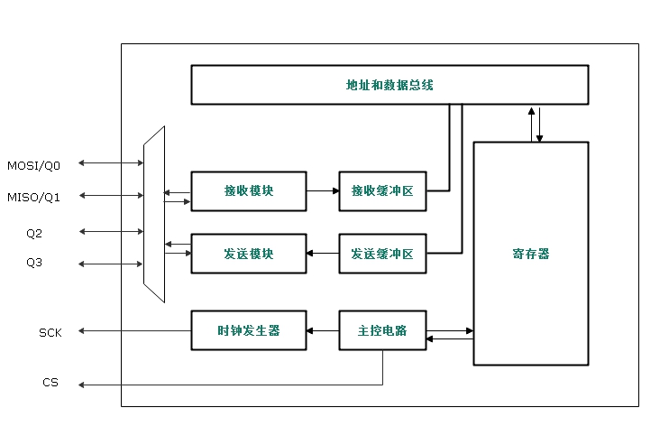
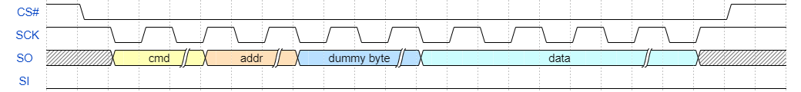
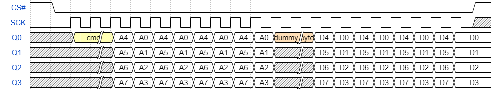

# SPI-MASTER 设备


## SPI-MASTER简介

串行外设接口(SPI)允许芯片与外部设备以半双工、同步、串行方式通信。此接口仅支持主模式，为外部从设备提供通信时钟(SCK)。通过配置相应的寄存器，可以定义SPI时钟预分配系数、传输模式、Dummy周期、中断功能等。时钟频率最高可达56M，数据宽度32bit，支持QSPI模式。

QSPI是Queued SPI简写，是Motorola公司推出的SPI接口扩展，比SPI应用更加广泛。在SPI协议的基础上，Motorola公司对其功能进行了增强，增加了队列传输的机制，推出了队列串行外围接口协议（即QSPI协议）。QSPI是一种专用的通信接口，连接单、双或四（条数据线）SPI Flash存储介质。最高传输速率是普通SPI总线的4倍，数据宽度同样也是32bit。

<font color= HotPink>**警告：由于48引脚封装，IO管脚资源紧张，不支持QSPI.**</font>

### SPI-MASTER主要特征

- 支持SPI和QSPI传输模式
- SPI读/写 CMD、ADDR、DUMMY、DATA长度均可配置，CMD，ADDR和支持中断功能，可配多种中断触发条件
- TX/RX FIFO深度为8,宽度为32Bits
- 仅支持Master
- MSB在前
- SPI总线忙状态标志

### SPI-MASTER功能与操作说明




**通常SPI通过4个引脚与外部器件相连：**

- MOSI：SPI模式设备输出引脚，发送数据。
- MISO：SPI模式设备输入引脚，接收数据。
- SCK：串口时钟引脚，设备输出
- CS：片选引脚，设备输出

### 数据发送与接收

**设备配置为SPI模式，配置步骤如下：**

- 配置GPIO复用，复用为SPI功能
- 设置SPI Dummy
-  读操作通过SPI的STATUS寄存器[0]发起，然后读取STATUS寄存器[20:16]判断是否接收到数据,若FIFO非空,通过RXFIFO读取数据
- 通过SPI的STATUS寄存器[28:24]判断发送FIFO是否有空，若FIFO有空，通过TXFIFO写入数据，然后通过STATUA寄存器[1]发送写操作

**设备配置为SPI模式，时序图如下：**




- SPI通信过程，数据在下降沿改变，上升沿锁存，此模块只支持一种时钟相位。
- MSB在前，若CMD或者ADDR不足32位，需移位到高位。
- Dummy byte根据外围器件定义，data只支持32bit。

**设备配置为QSPI模式，时序图如下：**




- QSPI通信过程，数据在下降沿改变，上升沿锁存，此模块只支持一种时钟相位。
- MSB在前，若CMD或者ADDR不足32位，需移位到高位。
- QSPI模式CMD需要按bit展开写入CMD寄存器，例如0xEB,展开成为0x11101011。
- Dummy byte根据外围器件定义，data只支持32bit。

## 访问SPIMASTER设备

应用程序通过库函数提供的SPIM控制函数来访问SPIM设备硬件，相关接口如下所示：

| 函数                   | 描述            |
| ---------------------- | --------------- |
| `void mem_init()`      | 复用GPIO口函数  |
| `void mem_set_dummy()` | 设置SPIM的dummy |
| `void mem_read()`      | SPIM读          |
| `void mem_write()`     | SPIM写          |


## SPIM引脚复用

通过下列函数对SPIM接口进行复用设置:

```C
void mem_init();
```

## 设置SPIM dummy

通过下列函数设置SPIM传输dummy：

```C
void mem_set_dummy(SPI_TypeDef *SPIx,uint8_t cycles);
```

## SPIM设备读

通过下列函数进行SPIM读操作：

```C
void mem_read(SPI_TypeDef *SPIx, int addr,uint8_t* buffer,uint8_t size);
```

## SPIM设备写

通过下列函数进行SPIM写操作：

```C
void mem_write(SPI_TypeDef *SPIx, int addr,uint8_t* buffer,uint8_t size);
```


## SPIM设备使用示例

```C
#include <stdio.h>
#include <pulpino.h>
#include <string_lib.h>
#include <utils.h>
#include "spi_flash.h"
#include <udma.h>
#include <int.h>
#include <spi.h>
#include <spim.h>

int main(int argc, char **argv)
{

uint32_t ID = 0;

uint8_t RamData1[4];
uint8_t RamData[4];

union{
	uint32_t U32;
	uint8_t chr[4];
	
}data;
/*puf initialize*/
init_puf(0);
/*spi initialize */
mem_init();

mem_read(UC_SPIM,0x1A107018,&ID,4);
printf("ID is %x\r\n",ID);

RamData1[0]	= 0x00;
RamData1[1]	= 0x00;
RamData1[2]	= 0x00;
RamData1[3]	= 0x01;

data.U32	=	1;

mem_write(UC_SPIM,0x00330000,&data.chr,4);

mem_read(UC_SPIM,0x00330000,&RamData,4);
printf("RamData1 0 is %x\r\n",RamData[0]);
printf("RamData1 1 is %x\r\n",RamData[1]);
printf("RamData1 2 is %x\r\n",RamData[2]);
printf("RamData1 3 is %x\r\n",RamData[3]);

	while(1);
	return 0;
}
```

