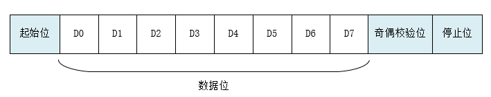

# UART 设备


## UART 简介

UART（Universal Asynchronous Receiver/Transmitter）通用异步收发传输器，UART 作为异步串口通信协议的一种，工作原理是将传输数据的每个字符一位接一位地传输。是在应用程序开发过程中使用频率最高的数据总线。

UART 串口的特点是将数据一位一位地顺序传送，只要 2 根传输线就可以实现双向通信，一根线发送数据的同时用另一根线接收数据。UART 串口通信有几个重要的参数，分别是波特率、起始位、数据位、停止位和奇偶检验位，对于两个使用 UART 串口通信的端口，这些参数必须匹配，否则通信将无法正常完成。UART 串口传输的数据格式如下图所示：

<div align = left> 
    
</div>

- 起始位：表示数据传输的开始，电平逻辑为 “0” 。
- 数据位：可能值有 5、6、7、8、9，表示传输这几个 bit 位数据。一般取值为 8，因为一个 ASCII 字符值为 8 位。
- 奇偶校验位：用于接收方对接收到的数据进行校验，校验 “1” 的位数为偶数(偶校验)或奇数(奇校验)，以此来校验数据传送的正确性，使用时不需要此位也可以。
- 停止位： 表示一帧数据的结束。电平逻辑为 “1”。
- 波特率：串口通信时的速率，它用单位时间内传输的二进制代码的有效位(bit)数来表示，其单位为每秒比特数 bit/s(bps)。常见的波特率值有 4800、9600、14400、38400、115200等，数值越大数据传输的越快，波特率为 115200 表示每秒钟传输 115200 位数据。

### UART主要特征

- 支持异步通信，调制解调器（CTS/RTS）操作
-  可编程数据字长度（8位或9位）
- 可配置停止位-支持1或2个停止位
- 3个带标志的中断源：发送完成；接收数据有效；接收水线溢出
- 检验控制：发送校验位，接收数据校验
- 错误检测标志：校验错误

UART结构框图如下所示：

<div align = left>
    
</div>

通常UART通过2个引脚与外部器件相连：

- TX：UART模式设备输出引脚，发送数据。
- RX：UART模式设备输入引脚，接收数据。


## 访问串口设备

| 函数                                     | 描述                   |
| ---------------------------------------- | ---------------------- |
| `void uartx_init();`                     | 初始化串口设备         |
| `void uartx_sendchar();`                 | 串口设备单字节发送     |
| `char uartx_getchar();`                  | 串口设备单字节接收     |
| `uint32_t uartx_send();`                 | 串口设备多字节发送     |
| `uint32_t uartx_recv();`                 | 串口设备多字节接收     |
| `void uartx_set_interrupt_type();`       | 设置串口设备中断类型   |
| `uint32_t uartx_is_interrupt_pending();` | 获取串口设备中断标志位 |
| `UART_II uartx_get_interrupt_id();`      | 获取串口设备中断号     |


## 初始化串口设备

```C
void uartx_init(UART_TYPE *UARTx,UART_CFG_Type *SDC_ConfigStruct);
```


## 串口设备单字节发送数据

```C
void uartx_sendchar(UART_TYPE *UARTx, uint8_t data);
```


## 串口设备单字节接收数据

```C
char uartx_getchar(UART_TYPE *UARTx);
```


## 串口设备多字节发送

```C
uint32_t uartx_send(UART_TYPE *UARTx, uint8_t *buf, uint32_t len);
```


## 串口设备多字节接收

```C
uint32_t uartx_recv(UART_TYPE *UARTx, uint8_t *buf, uint32_t len);
```


## 串口设备中断类型设置

```C
void uartx_set_interrupt_type(UART_TYPE *UARTx,UART_IT it_type);
```


## 获取串口设备中断标志位

```C
uint32_t uartx_is_interrupt_pending(UART_TYPE *UARTx);
```


## 获取串口设备中断号

```C
UART_II uartx_get_interrupt_id(UART_TYPE *UARTx);
```


## 串口设备使用示例

```C
#include <stdio.h>
#include "event.h"
#include "int.h"

#define _TEST_UARTX

#ifdef _TEST_UARTX
#include <string.h>
#include "pulpino.h"
#include "uartx.h"
#else
#include "uart.h"
#endif

#ifdef _TEST_UARTX
static char buf[1024]={0};
static volatile uint32_t buf_len=0;
#endif

void ISR_UART0(void)
{
#ifndef _TEST_UARTX
    if(uart_get_int_identity()&0x4)
    {
        printf("uart_rec = %d\n",uart_getchar());
    }
#else
    uint8_t data[64+1];
    uint32_t len;
    UART_II ii;

    ICP |= 1<<23;//clear uart interrupt pending
    
    if (uartx_is_interrupt_pending(UC_UART)){
    	
        ii = uartx_get_interrupt_id(UC_UART);
        //printf("ii = %02x\n",ii);
        if (ii == UART_II_RDA)
        {
            memset(data, 0, 65);
            len = uartx_recv(UC_UART, data, 64);
            sprintf(&buf[buf_len],"ii = %02x len = %d uart_rec = %s\n",ii, len, data);
            //printf("ii = %02x len = %d uart_rec = %s\n",ii, len, data);
            buf_len = strlen(buf);
        }
    }

#endif
}

#ifdef _TEST_UARTX
void delay_ms(uint32_t nms)
{
    for(int i=0;i<nms;i++)
    {
        for(int j=0;j<9600;j++)
        {
            asm("nop");
        }
    }
}
#endif

int main(int argc, char **argv)
{
#ifdef _TEST_UARTX
    UART_CFG_Type uartx_cfg;
    uartx_cfg.Baud_rate = 115200;
    uartx_cfg.Parity = UART_PARITYBIT_NONE;//'N'
    uartx_cfg.Databits = UART_DATABIT_8;
    uartx_cfg.Stopbits = UART_STOPBIT_1;//1
    uartx_cfg.level = UART_TL_BYTE_14;

    uartx_init(UC_UART, &uartx_cfg);
    uartx_set_interrupt_type(UC_UART, UART_IT_RX);

#endif
	printf("hello world\n");
    IER |= 1<<23;//enable uart interrupt
    int_enable();
#ifdef _TEST_UARTX
    delay_ms(5*1000);//wait for receiving data
    printf("received data=\n");
    printf("%s", buf);
#endif
    while(1);
	return 0;
}


```

