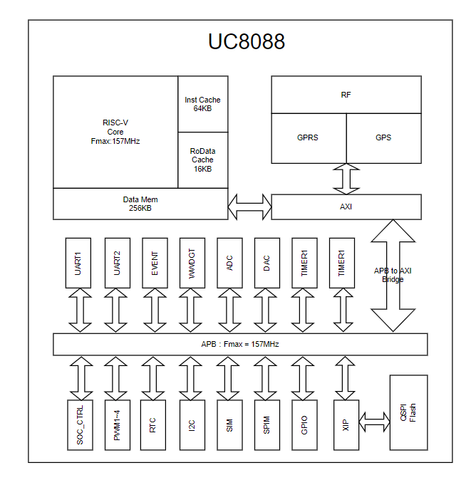

# UC8088总线结构

## 系统结构

主系统由3个驱动单元和3个被动单元组成。3个驱动单元包括RISC-V内核RoData Cache，指令 Cache，基带数据和控制总线。3个被动单元包括内部Data Mem，内部QSPI 闪存存储器和AXI到APB的桥。如图所示：

                                                

​                                                                                  

 

