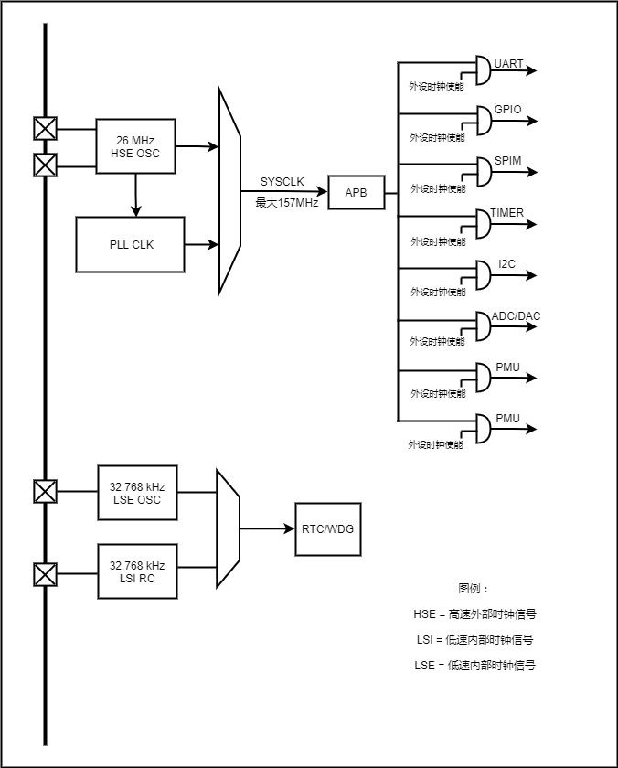

## UC8088时钟

两种不同的时钟源都可以驱动系统时钟（SYSCLK）：

- HSE振荡器时钟

- PLL时钟

这些设备有以下2种二级时钟源：

- 32.768kHz低速内部RC，可以用于驱动独立看门狗和通过程序选择驱动RTC。 RTC用于从停机/
  待机模式下自动唤醒系统。
-  32.768kHz低速外部晶体也可用来通过程序选择驱动RTC(RTCCLK)。  

当不被使用时，任一个时钟源都可被独立地启动或关闭，由此优化系统功耗。  

## 时钟树

