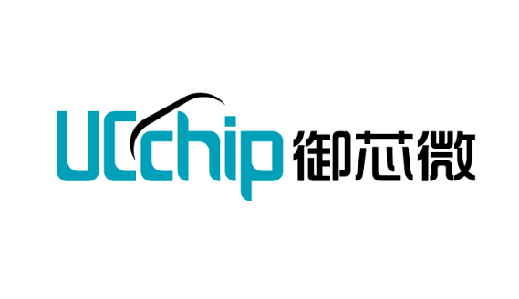

# Welcome to UCchip's documentation!

御芯微是一家面向亿万级智能物联网市场的创新型企业，其核心技术团队汇聚了海内外芯片设计、芯片工具开发、物联网行业应用等方面专家，依托于自主的“敏捷芯片开发方法”、“广域物联网通信协议(WloTa)”、“重要行业深度解决方案”三大战略平台，快速定制化低成本、低功耗物联网SoC芯片，为各行业提供芯片级的、最优秀的物联网解决方案。 御芯微始终以“自主技术创新，助力各行业智能化产业升级”为使命，秉承“用户导向、技术领先、敏捷”的经营理念，为打造中国物联网产业第一品牌而持续奋斗。 目前公司已建有北京、重庆和成都三大研发中心，长三角研发中心正在筹备中。 服务范围包括：“定制芯片、芯片销售、组网设备、终端设备、整体解决方案提供、物联网服务提供、联合研发和运营物联网产品等。”

### 简介

本文档包含了我们公司所有产品的使用指南，常见问题以及开发环境。如果您对我司产品有任何现有文档无法回答的问题，请随时在 [UCForum](https://uc8088.com/)上寻求帮助。

