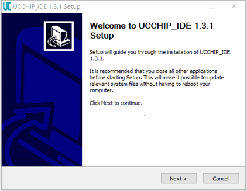
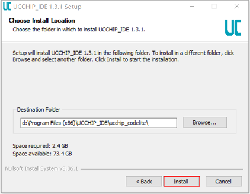
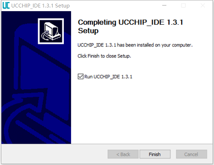
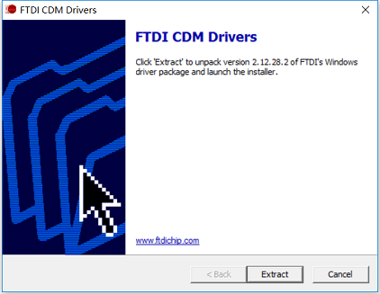
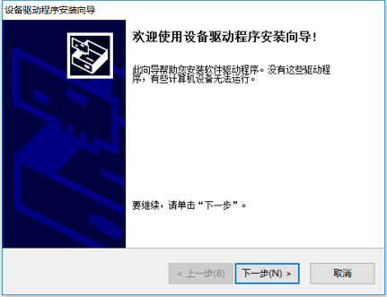
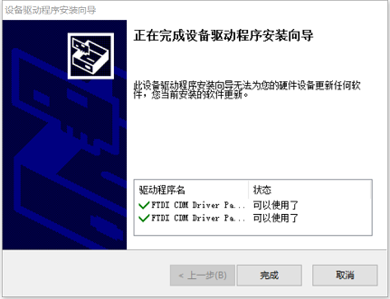
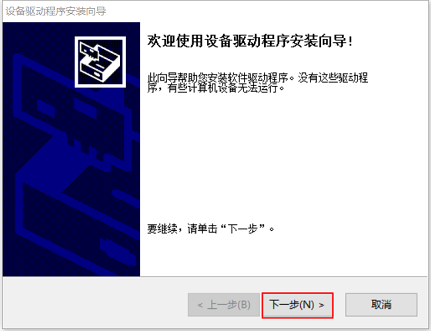

# UCCHIP IDE 安装

UCCHIP IDE当前提供Windows 64位操作系统安装版本，如果对其他系统有诉求，请联系我们。

### 获取安装文件

###### Windows 

获取UCCHIP IDE安装包：[UCCHIP IDE Windows](https://uc8088.com/t/topic/49)

安装包包含了Windows 开发环境所需的IDE，RISCV GCC编译器，UC-DAP5仿真驱动。

### 安装指导

###### Windows 

双击UCCHIP-IDE-Setup-WIN-x64-X.XX.X.exe ,依照屏幕提示，安装集成开发环境。 

​                                                   

使用默认，或者设置程序的安装位置，点击下一步。

​                                                   

安装完成后，界面如下：

​                                                    

### 仿真器设备驱动

UCCHIP系列芯片采用UC-DAP5仿真器，需要安装串口驱动和调试口驱动。

###### Windows

双击CDM21228_Setup.exe,依照屏幕提示，安装串口驱动。

​                                                      

获取ftdi驱动，一直点击下一步。 

​                                                   

安装完成后，界面如下：

​                                                   

双击UC_DAP_Setup.exe,依照屏幕提示，安装串口驱动。

​                                                   

点击下一步，安装完成后，界面如下：

​                                                   

