# 编译下载

### 获取例程代码

uc8088例程代码：[uc8088 demo](https://uc8088.com/t/topic/28)

uc8288例程代码：[uc8288 demo]()

### 编译例程

打开UCCHIP IDE，点击Open Workspace：

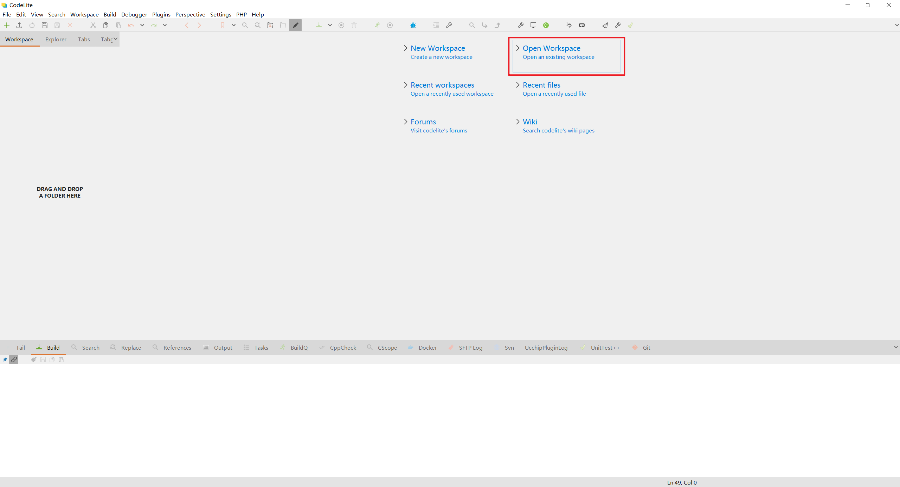

选择目录下uc8088.workspace文件：

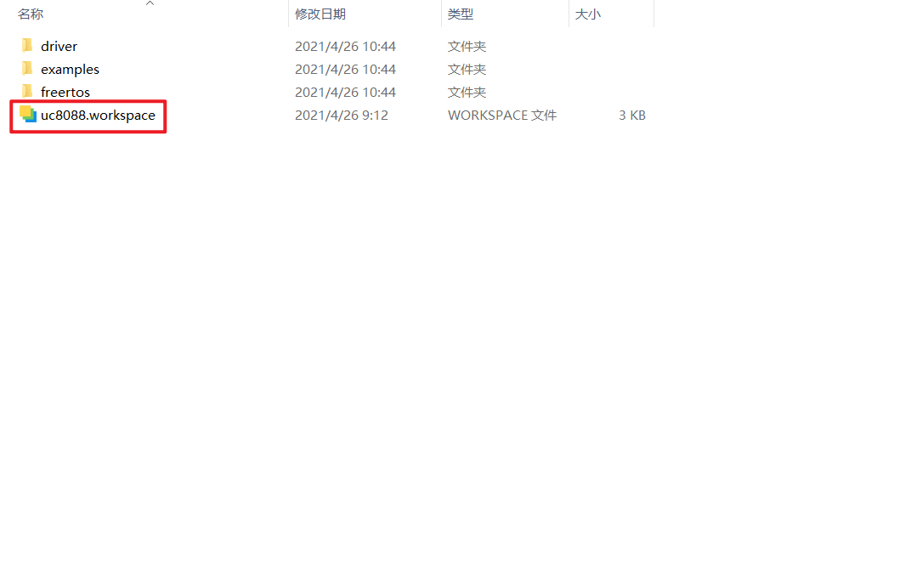

打开例程后如图所示：

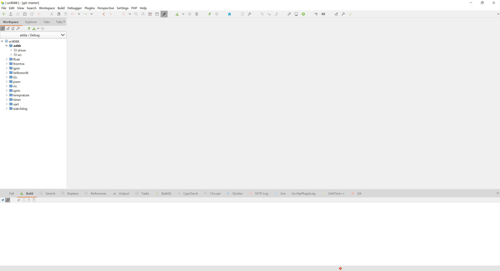

双击左侧helloworld工程，当字体变倾斜时，表示选中了该工程，之后的编译下载都是针对该工程而言：

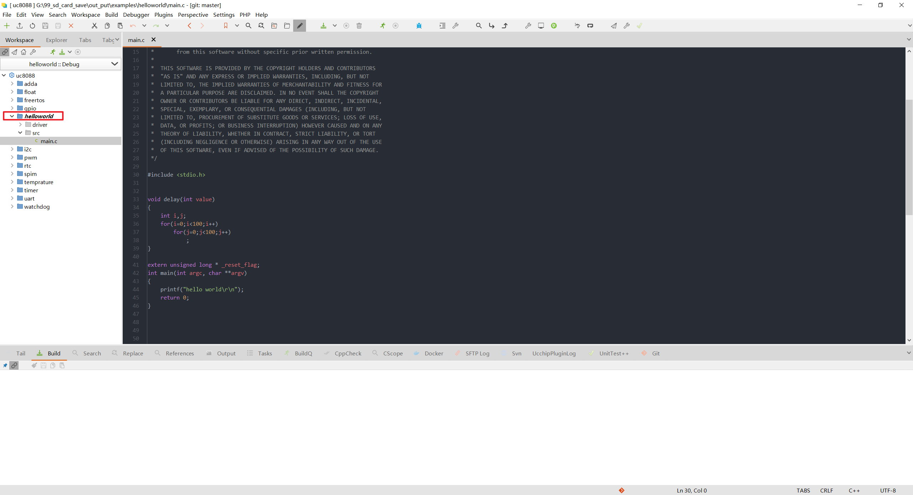

点击上方工具栏图标(1)或左侧图标(2)开始编译当前工程，也可以右键单击工程，在弹出的菜单中选择build(3)，编译快捷键F7：

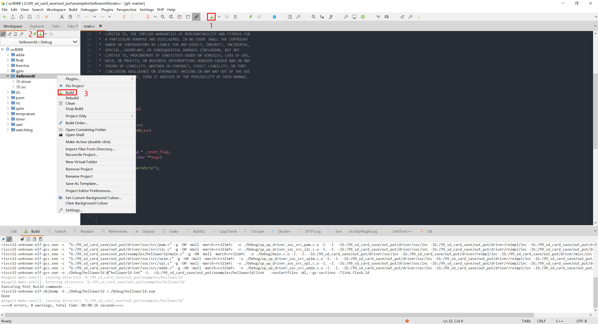

编译完成后可在下方的log栏中查看编译的错误和警告：

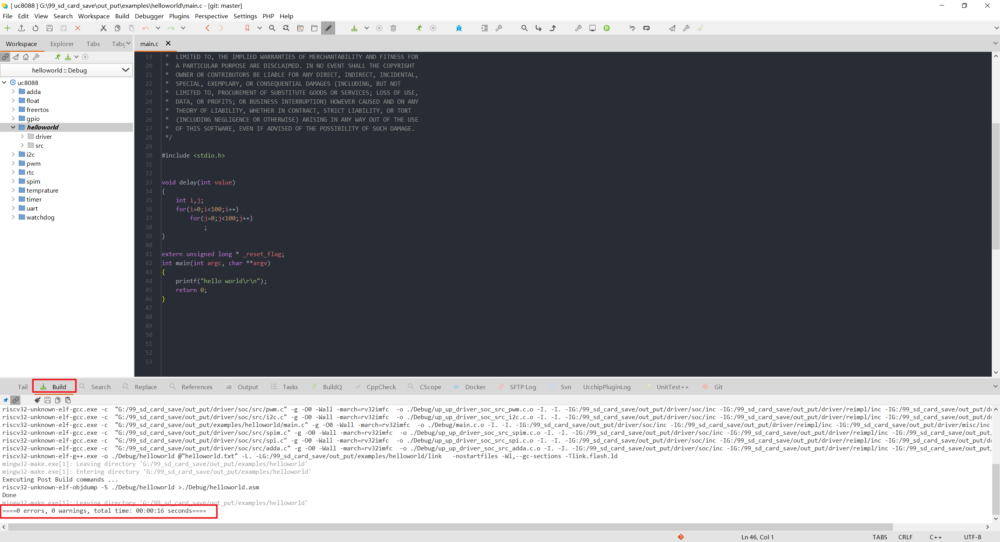

若编译出错，双击log栏中的提示，界面会自动跳转到错误位置，同时也会标注错误的行数：

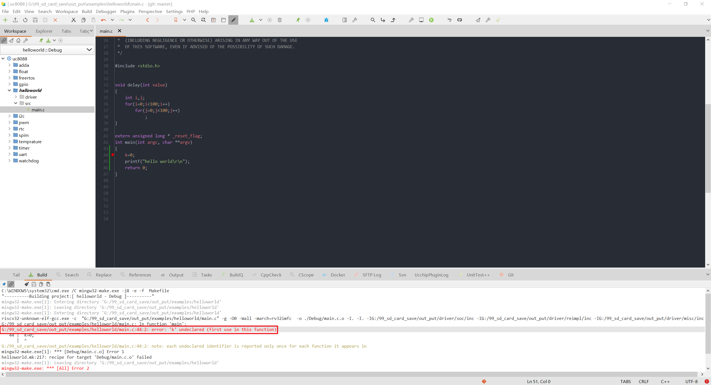

### 下载

编译通过后，将开发板连接烧写器，再将烧写器连接到PC，正确连接后，可以在windows的设备管理器中查看到一个串口和一个RS232：

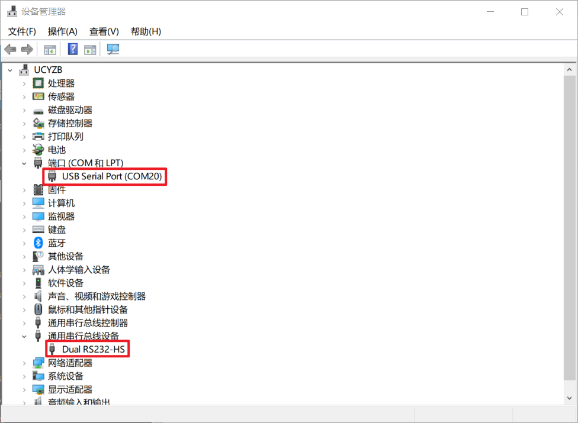

点击上方工具栏图标开始下载程序：

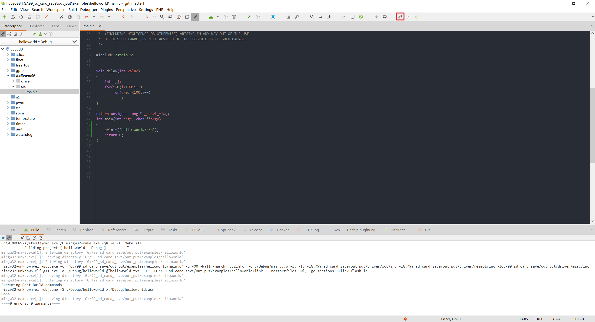

下载完成后点击OK完成下载：

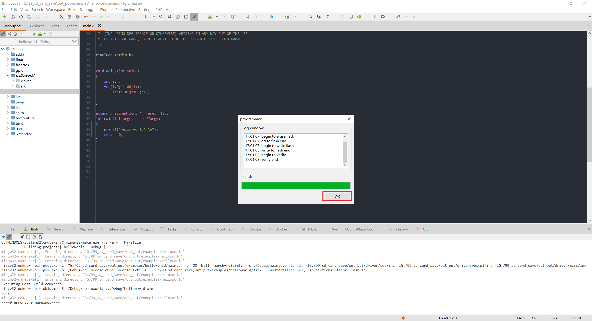

若提示没有找到flash，检查开发板与烧写器是否正常连接和开发板是否正常供电：

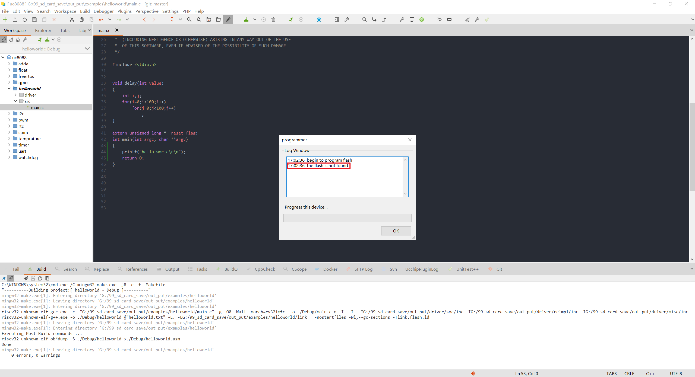

下载完成后，可以打开串口助手，查看串口的打印信息:

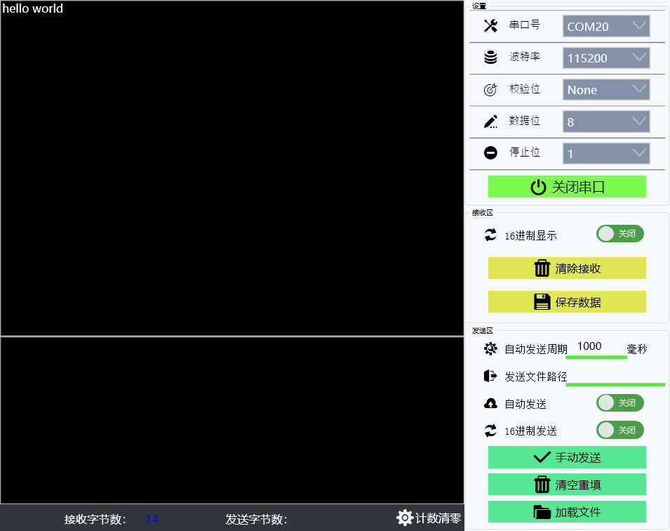

