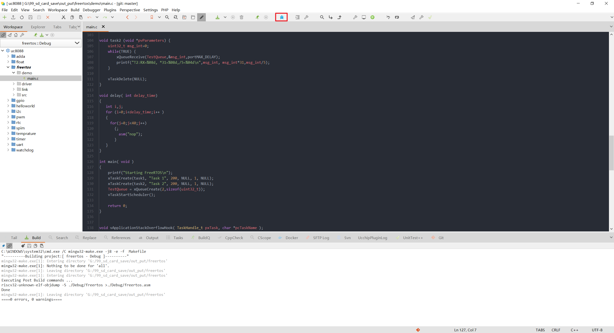
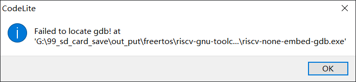
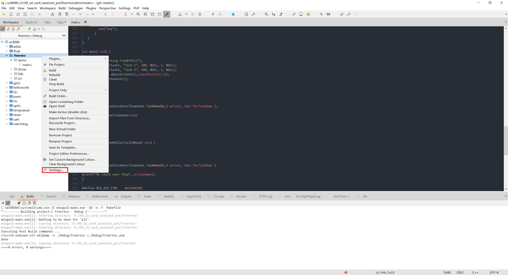
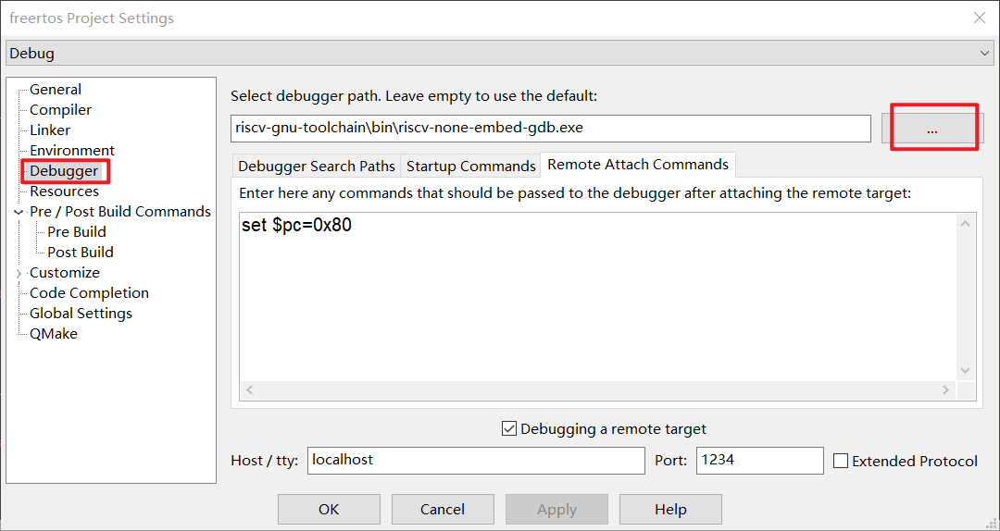
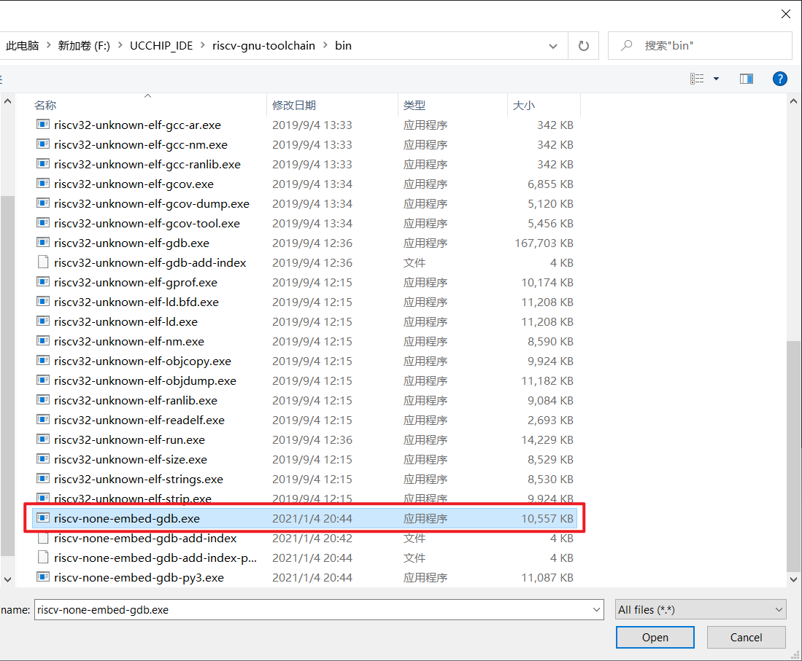
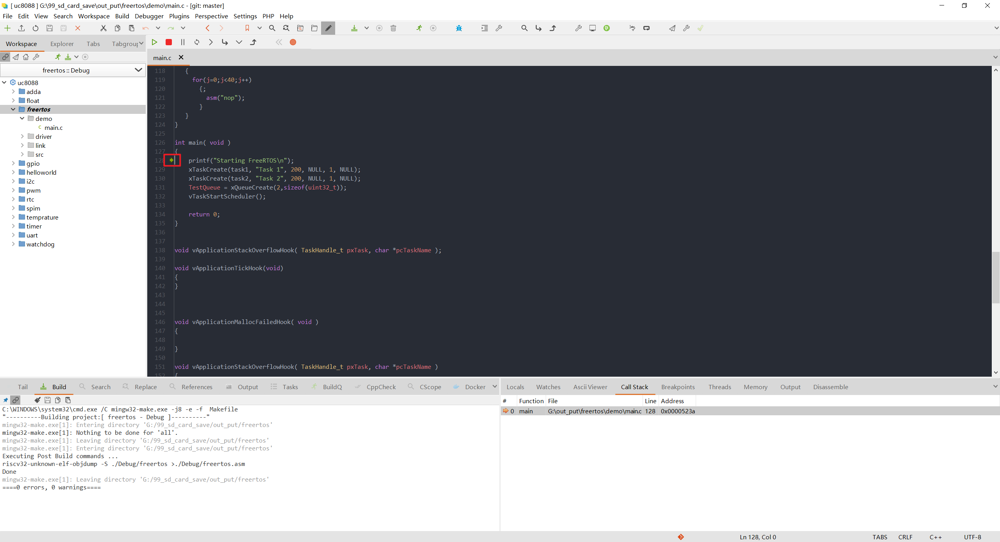
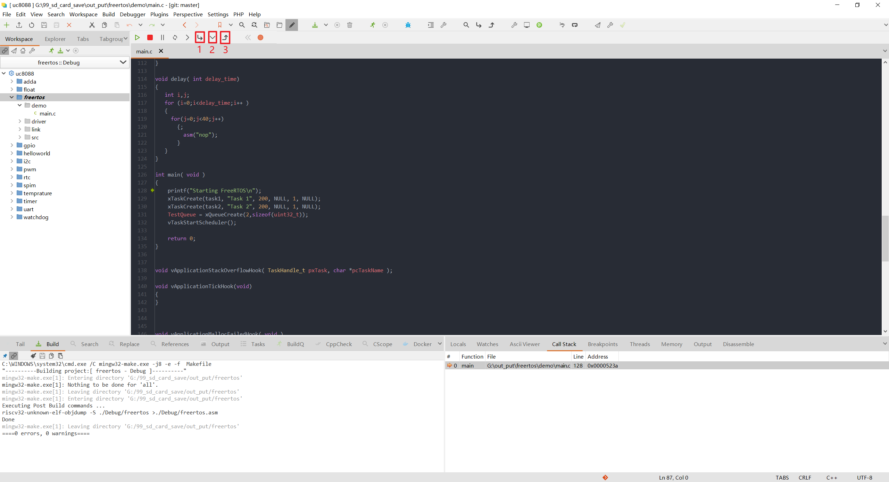
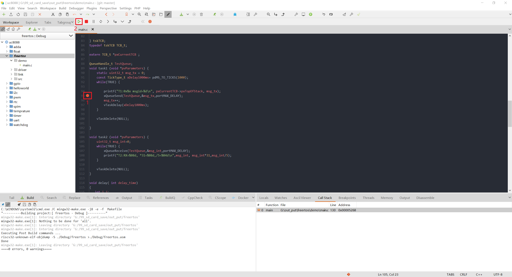
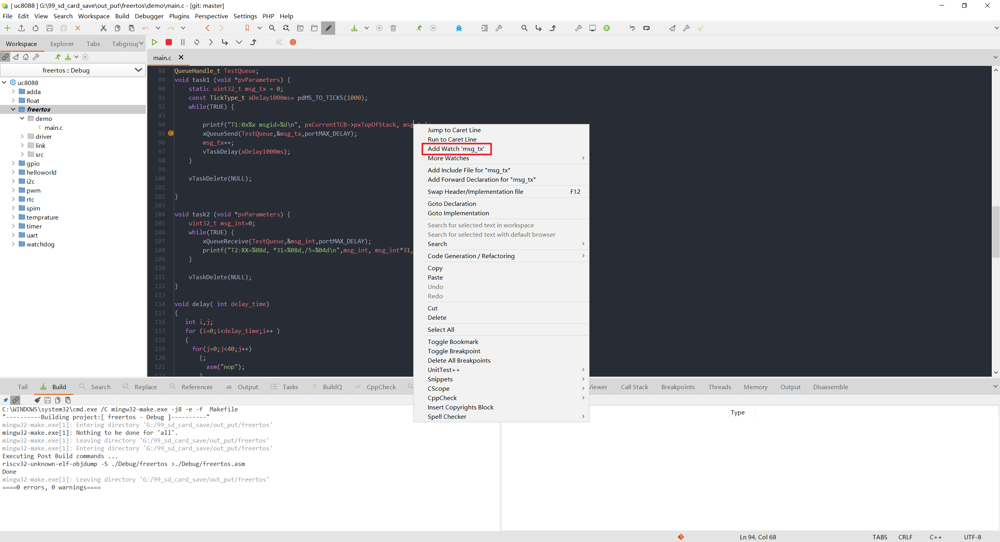
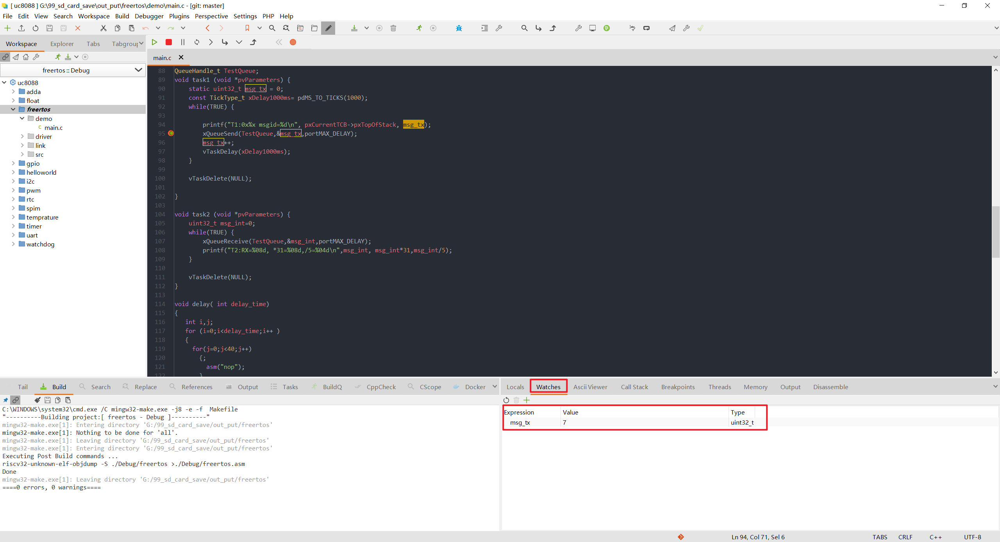

# 调试

程序下载完成后，可以点击工具栏图标进入DEBUG调试模式：

若提示**Failed to locate gdb!**

右键单击工程，选择**Settings...**进入工程设置界面：

重新选择debugger path：

gdb在UCCHIP_IDE安装目录下的riscv-gnu-toolchain->bin文件夹内：

gdb配置完成后，重新点击上方工具栏图标进入DEBUG调试模式，成功进入DEBUG后，代码左侧会出现一个绿色箭头，代表当前程序运行的位置。若没有出现绿色箭头，退出DEBUG，按键复位开发板，重新进入DEBUG：

可以通过点击工具栏的**Next**键(2)运行到程序下一步，**Step Into**(1)进入到函数内部，**Step Out**(2)跳出函数：

点击代码右侧(1)添加断点，再点击**Continue**(2)程序运行到断点处：

双击一个变量，右键选择**Add Watch**将变量添加到观测区：

可以在观测区看到变量具体的值和类型：

